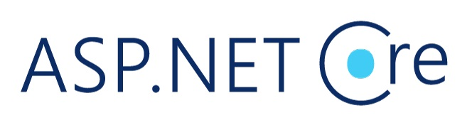
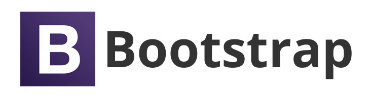

<h1 align="center"> ProgGuru </h1>

 

#

 

 

 

As a part of pre-diploma practice at **[JSC "Itransition"](https://www.itransition.com)** was developed a web application like a **social network for IT specialists and companies** to simplify the process of creating a resume and portfolio.

Web application developed on ABP Framework with **layered architecture** based on **DDD** principles and patterns.

 

## **Quick navigation**

  - [Concept](#concept)
  - [Target audience](#target-audience)
  - [Description](#description)
  - [Design](#design)
  - [Structure](#structure)
  - [Information base](#information-base)
  - [Code overview](#code-overview)
  - [Development tools](#development-tools)
  - [Usage](#usage)
  - [Demo](#demo)

 

## Concept

Social network for the organization of a unified information environment aimed at improving and automating the resume and portfolio creation process. With the help of which IT specialists will be able to find and establish business contacts among themselves.

 

## Target audience

- Interested in **finding work in IT**
- Interested in **finding teams for project**
- **IT-companies** that need to hire IT-specialists of various levels
- **IT-specialists** of various levels
- Persons that need in professional **guidance** and **feedback**

 

## Description
**«ProgGuru»** aims to brings together the all useful functionality separately found on different IT-sites. For example, **articles** about different technologies, a **personal CV** of each user and **portfolio**, which consists of **projects** divided into **categories** and **technologies** (_game, web, C#, asp.net_, etc.) with their own specific **state** (_completed, abandoned, during_). Projects, in turn, can take you to a **repository with code** and also to a finished project (if it is completed) for viewing and testing.

<!-- 
На сайте можно не только презентовать себя, как специалиста, но также и знакомиться с другими, более опытными специалистами, общаться с ними на профессиональные темы, получать фидбек или помощь для своего проекта, читать и писать свой блог, делится идеями, подписываться на интересующие технологии.

Страница зарегистрированного пользователя является его резюме со всей необходимой информацией вместе с портфолио, если оно имеется.

При публикации своего проекта, пользователем предоставлена базовая информация – категория проекта, его статус, дата публикации, дата релиза, ссылка на git-репозиторий, ссылка на пользование и т.д.

Пользователь сможет вести свой персональный блог по различным интересующим его технологиям, а также писать статьи по своему личному проекту. Он сможет подписываться на интересующие его технологии. 

Другие пользователи смогут оставлять отзывы об специалистах, которые будут формировать их рейтинг. С помощью возможности общения на веб-сервисе можно легко связаться со специалистом, нажав соответствующую кнопку на его личной странице.

Имеется разделение на администратора и обычных пользователей. Администратор имеет возможность быстрого доступа к просмотру информации обо всех зарегистрированных пользователях, их проектов, статей, всех доступных сообществ, тегов и т.д., а также ее удалению и редактированию. Кроме того, администратор имеет доступ к общим настройкам сайта. 

Авторизированные пользователи могут создавать проекты, писать статьи, оставлять комментарии и отзывы, ставить оценки, общаться. Неавторизированным на сайте пользователям доступны только главная страница и страница авторизации.-->

 

## Design

<!-- Стиль «Flat Design» был выбран для оформления сайта, поскольку плоский стиль позволяет гармонично расставлять акценты на различных составляющих страницы. Такая упрощенность позволяет лучше визуально воспринимать информацию и быстрее находить нужные функции. 

Приложение оформлено в синей цветовой гамме с элементами ярко-фиолетового цвета.

Благодаря наличию удобной системы навигации и продуманного адаптивного дизайна, пользователь легко получает доступ к необходимой информации и не использует затруднений в процессе навигации по разделам ресурса.

Визуальное оформление спокойное и не отвлекает от работы. Дизайн веб-сайта является современным. Для представления текстовых материалов используется шрифт Noto Sans. 

Язык разметки гипертекста HTML используется только для описания структуры документа, в то время как управление внешним видом веб-страниц осуществляется с помощью каскадных таблиц стилей CSS. -->

 

## Structure

<!-- Веб-приложение состоит из клиентской и серверной частей, тем самым реализуя технологию «клиент-сервер».

Разработка веб-приложения «PogGuru» происходит на базе технологии ASP.NET MVC с использованием ABP Framework.

Фреймворк имеет ряд преимуществ, основным из которых является то, что он разработан на базе шаблонов и принципов DDD [12];

ABP Framework позволяет разбить приложение по слоям.

Предусмотрены хеш-функции для безопасного хранения секретов (паролей) в базе данных. 

Предусмотрено хранение всех изображений, загружаемых пользователями на Веб-сайт, на облачном сервисе Cloudinary. -->

 

## Information base

<!-- В качестве поставщика базы данных был выбран Entity Framework Core. В качестве СУБД была выбрана Microsoft SQL Server 2019. 

Сущности – одна из основных концепций DDD (Domain Driven Design).

Доменные объекты выражают сущности из модели предметной области, относящейся к программе, и реализуют бизнес-логику программы. Разрабатываемое приложение содержит такие доменные объекты, как «сообщество», «проект», «вакансия».

Для обозначения первичного ключа был выбран тип Guid. ABP фреймворк предоставляет IGuidGenerator сервис, который создает последовательные идентификаторы Guid. Он оптимизирован для генерации последовательных Guid, что очень важно для кластеризованных индексов в реляционных базах данных. -->

 

## Code overview

<!-- Уровень представления

Для примера рассмотрим модель страницы сообщества. Она описана в файле Index.cshtml.cs и представлена ниже:

public class IndexModel : ProgGuruPageModel
    {
        public IReadOnlyList<GroupDto> Groups { get; set; }
        private readonly IGroupAppService _groupAppService;
        public IndexModel(IGroupAppService groupAppService)
        {
            _groupAppService = groupAppService;
        }
        public async Task OnGetAsync()
        {
            var result = await _groupAppService.GetListAsync(new GetGroupListDto { Filter = null });
            Groups = result.Items;
        }
    }

Метод OnGetAsync() обращается к сервису управления группами на уровне приложения и с помощью него получает список всех групп без какого-либо фильтра выборки. Далее, свойство Groups получает их, чтобы отобразить в представлении. 

Уровень приложения

Перейдём на уровень приложения и рассмотрим класс GroupAppService. В нём описаны следующие методы:
– «CreateAsync». Используется для создания сообщества;
– «DeleteAsync». Используется для удаления сообщества;
– «GetAsync». Используется для получения сообщества;
– «GetListAsync». Используется для получения списка сообществ;
– «UpdateAsync». Используется для редактирования сообщества.
Рассмотрим метод CreateAsync(), код которого представлен ниже:

     [Authorize(ProgGuruPermissions.Groups.Create)]
        public async Task<GroupDto> CreateAsync(CreateGroupDto input)
        {
            var group = await _groupManager.CreateAsync(
                input.Title,
                input.Subtitle,
                input.TextInformation,
                input.Developer,
                input.IssueYear,
                input.Website
            );

            await _groupRepository.InsertAsync(group);
            // Return an GroupDto representing the newly created author
            return ObjectMapper.Map<Group, GroupDto>(group);
        }

Метод получает входящую модель группы, затем создает новую и заполняет его данными входящей группы. Здесь используется такой же метод CreateAsync, но уже описанный в классе GroupManager, который содержит основную бизнес-логику сообществ.

Таким образом, если поля входящей группы были заполнены не верно, на уровне домена в методе CreateAsync класса GroupManager сгенерируется исключение и создать группу будет невозможно.

Уровень домена

Рассмотрим метод CreateAsync класса ProjectManager, в котором описывается вся бизнес-логика для пользовательских проектов:

public async Task<Project> CreateAsync(
            [NotNull] Guid creatorId,
            [NotNull] Guid groupId,
            [NotNull] string title,
            [NotNull] string subtitle,
            [NotNull] string textInformation,
            [NotNull] string coverImagePath,
            [NotNull] ProjectCategory category,
            [NotNull] ProjectStatus status,
            [NotNull] DateTime publishDate,
            [CanBeNull] DateTime? realeseDate = null,
            [CanBeNull] string[] tagNames = null,
            [CanBeNull] string goToUseLink = "",
            [CanBeNull] string goToGitLink = "")
        {
            await TryCreatePostAsync(creatorId, title, subtitle, textInformation, coverImagePath);
            await checkIfGroupIsExistsAsync(groupId);
            Check.NotNull(category, nameof(category));
            checkIfProjectStatusValid(status, publishDate, realeseDate);
            var project = new Project(
                GuidGenerator.Create(),
                creatorId,
                groupId,
                title,
                subtitle,
                textInformation,
                coverImagePath,
                category,
                status,
                publishDate,
                realeseDate,
                goToUseLink,
                goToGitLink
            );
            await SetTagsAsync(project, tagNames);
            return project;
        }

В параметрах данного метода уже устанавливаются требования к ним с помощью атрибутов [NotNull] и [CanBeNull], которые указывают, могут ли данные параметры содержать значения null.

Далее вызываются методы проверки поступивших полей, чтобы проверить их корректность. В случае их корректности создается новый проект, в конструктор которого передаются данные поля. Иначе вызывается исключение и создать проект невозможно. Исключение выбрасываются в методах проверки, например, как это сделано в методе checkIfGroupIsExistsAsync, проверяющем существует ли указанная группа в базе данных:

private async Task checkIfGroupIsExistsAsync([NotNull] Guid groupId)
        {
            Check.NotNull(groupId, nameof(groupId));
            var existingGroup = await _groupRepository.FindByIdAsync(groupId);
            if (existingGroup == null) throw new GroupDoesntExistsException(groupId);
        }

-->

 

## Development tools

- Visual Studio 2022
- **C#** programming language
- **JavaScript** programming language
- **HTML5** markup language
- **CSS** stylesheet language
- **jQuery** library
- **Bootstrap** library
- **ASP.NET MVC** framework
- **ABP framework** version 5.1
- PowerShell command prompt
- ABP CLI 5.1.2 command prompt tool
- MS SQL Server 2019

 

## Usage

<!-- При входе на сайт до момента авторизации доступны только страницы «Главная» и «Авторизация». Страница «Главная» является точкой входа. 

После регистрации необходимо подтвердить введенную электронную почту с помощью ссылки, отправленной на нее. Пользователь может зарегистрироваться также с помощью двух социальных сетей – Google и Facebook. 

С помощью страницы сброса пароля можно установить новый пароль для своего аккаунта в случае, если он был забыт. На почту придёт ссылка, по которой необходимо перейти и ввести новый пароль для своего аккаунта.

На сайте доступно 2 языка - английский и русский. Для изменения языка, в шапке сайта необходимо нажать на ссылку с названием выбранного языка. В данном случае это «Русский». После нажатия открытия список языков.

На странице имеется поиск, по которому можно найти что-то конкретное и открыть на просмотр.

Страница с сообществом содержит всю информацию о сообществе, включая написанные по нему статьи и подписанных на него пользователей.

Страница с пользователем представляет собой его резюме с указанием всей необходимой информацией, а также с его проектами, статьями, подписками и подписчиками.

Страница с проектом содержит всю информацию о проекте – рейтинг, ссылки, теги, включая код, команду, новости, возможность перевода средств на поддержку, а также комментарии.

При входе в систему под пользователем, имеющим роль «Администратор (Admin)», вы получаете доступ к панели управления администратора, состоящей из следующих пунктов: «Управление идентификацией», «Настройки», «ProgGuru».

Пункт «Управление идентификацией» содержит пункты «Роли» и «Пользователи». После перехода по ним открывается таблица для управления ролями или пользователями. В таблице с ролями, можно настроить для каждой роли ее возможности, расставив галочки.

Пункт «Настройки» содержит некоторые настройки сайта. Здесь можно настроить отображаемое имя сайта, его адрес, электронную почту, а также настроить сообщения, отправляемые по электронной почте.

Пункт «ProgGuru» содержит список всех таблиц приложения ProgGuru, таких как таблиц сообществ, проектов, тегов, статей и т.д. -->

 

## Demo

<!-- 
демо (изображения, ссылки на видео, интерактивные демо-ссылки);

технологии в проекте;

что-то характерное для проекта (проблемы, с которыми пришлось столкнуться, уникальные составляющие проекта);

техническое описание проекта (установка, настройка, как помочь проекту).-->